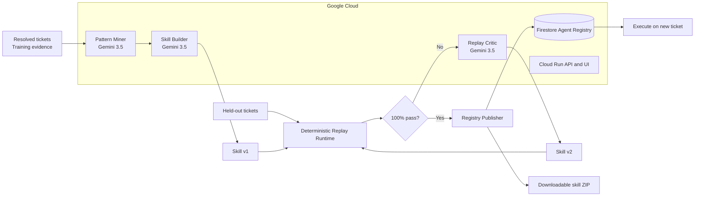

# Ticket2Skill

**Turn resolved enterprise work into tested, versioned agent skills.**

Ticket2Skill is an autonomous skill compiler built for the [All Things Agentic Hackathon](https://allthingsagentichackathon.devpost.com/). Gemini 3.5 mines repeated workflows from resolved support tickets, creates an executable skill, replays it against held-out cases, repairs regressions, and publishes only a proven version.

**Live demo:** https://ticket2skill-1027721936124.us-central1.run.app

## Tangible result

The pipeline produces a downloadable skill package rather than another chat response:

```text
vpn-access-recovery-v2/
├── skill.yaml          # inputs, workflow, tools, policies
├── agent.py            # executable generated agent artifact
├── policy.json         # machine-readable governance rules
├── eval-report.json    # held-out replay evidence
└── README.md
```

The published version is also stored in a Firestore Agent Registry and can immediately process a new unseen ticket with an auditable tool trace.

## Demo flow

1. Pattern Miner analyzes eight synthetic resolved VPN tickets.
2. Gemini 3.5 compiles `vpn-access-recovery:v1` from evidence present in those tickets.
3. Held-out replay exposes two unseen enterprise policies: contractors require manager approval, and terminated users must be denied.
4. Replay Critic generates `v2` from the failure evidence.
5. The same held-out regression gate improves from **50% to 100%**.
6. Registry Publisher writes the proven skill to Firestore and creates the ZIP package.
7. The published skill processes a fresh queue: it auto-resolves a standard employee case, creates an approval request for a contractor, and denies a terminated identity before credential mutation.

## Why it is different

Existing agent evaluation tools start with an agent that someone already built. Ticket2Skill starts with the history of successful human work and autonomously creates a new reusable capability.

```text
Resolved work → generated skill → held-out replay → AI repair → versioned publication
```

Evaluation is not the product; it is the publication gate for an autonomous work-to-skill compiler.

## Architecture



More detail: [`docs/architecture.md`](docs/architecture.md).

## Google technology

- **Gemini 3.5 Flash** through Vertex AI global endpoint
- **Google GenAI SDK** as the agent framework
- **Cloud Run** for the deployed API and demo UI
- **Firestore** for the versioned Agent Registry
- **Cloud Build** and **Artifact Registry** for container delivery

Google Cloud project: `ticket2skill-agentic-26`. No corporate data or services are used.

## Local development

```bash
/opt/homebrew/bin/python3.12 -m venv .venv
.venv/bin/pip install -e '.[dev]'
GOOGLE_CLOUD_PROJECT=ticket2skill-agentic-26 \
GOOGLE_CLOUD_LOCATION=global \
TICKET2SKILL_MODEL=gemini-3.5-flash \
make run
```

## Deploy

```bash
gcloud builds submit \
  --project=ticket2skill-agentic-26 \
  --tag=us-central1-docker.pkg.dev/ticket2skill-agentic-26/ticket2skill/app:VERSION .

make deploy
```

## Safety and evaluation

All demo tickets are synthetic. Training and held-out cases are explicitly separated. Gemini creates and repairs the skill, while a deterministic runtime checks outcomes, tool authorization, policy behavior, and tool-call ordering. A skill cannot be published unless it achieves 100% on the held-out replay gate.

## Repository

This project was created from scratch for the All Things Agentic Hackathon in a personal GitHub account.
