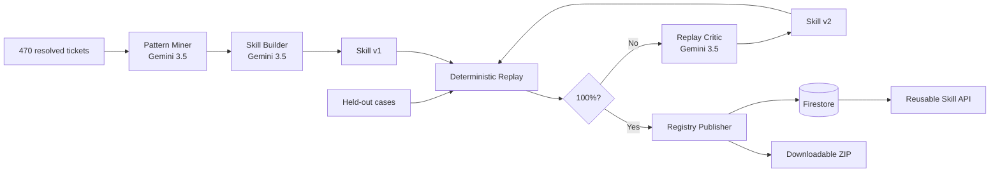

# Ticket2Skill

**Turn resolved enterprise work into tested, reusable agent skills.**

Ticket2Skill is an autonomous work-to-skill compiler created for the [All Things Agentic Hackathon](https://allthingsagentichackathon.devpost.com/). Gemini 3.5 mines repeated workflows from resolved enterprise tickets, generates an executable skill, replays it against unseen policy cases, repairs regressions, and publishes only a proven version.

**Live demo:** https://ticket2skill-1027721936124.us-central1.run.app

## The result

Ticket history becomes a reusable production capability instead of another report or chat response:

```text
Resolved tickets → Gemini skill v1 → held-out replay → Gemini repair → skill v2 → registry
```

The current synthetic enterprise catalog contains 470 varied resolved tickets:

| Category | Evidence tickets | Example capability |
|---|---:|---|
| VPN access | 200 | Verify identity, revoke sessions, issue recovery |
| Jenkins failures | 120 | Diagnose and retry safe transient jobs |
| New hardware requests | 80 | Replace broken assets while enforcing device limits |
| Database access | 40 | Grant expiring least-privilege access |
| SonarQube access | 30 | Grant project-scoped roles and protect admin access |

Each category has separate training evidence, held-out policy exceptions, and a fresh work queue.

## How it works

1. Select a category.
2. Gemini 3.5 reads every resolved ticket in that category as structured JSON evidence.
3. Pattern Miner and Skill Builder compile `skill:v1` using only patterns visible in the evidence.
4. A deterministic runtime replays v1 against held-out cases that Gemini has not seen.
5. Replay Critic receives the failure evidence and generates `skill:v2`.
6. The same held-out gate must reach 100% before publication.
7. Registry Publisher writes the versioned skill and evidence to Firestore.
8. The published skill processes a new work queue, produces business artifacts, and is available through an API and downloadable package.

The 200-ticket VPN run currently demonstrates:

```text
v1 replay: 33% — contractor and terminated-user policies missing
v2 replay: 100% PASS
```

## Tangible artifacts

Every published version produces:

```text
category-skill-v2/
├── skill.yaml          # inputs, tools, workflow, and policies
├── agent.py            # ready-to-call Gemini wrapper
├── policy.json         # governance rules
├── eval-report.json    # held-out replay evidence
└── README.md           # usage instructions
```

The same version is stored in the Firestore Agent Registry.

## Use a published skill

### REST API

```http
POST /api/skills/{registry_id}/execute
Content-Type: application/json
```

### Download and give it to Gemini

```python
from agent import run_with_gemini

result = run_with_gemini(
    {
        "issue": "Employee lost database access",
        "attributes": {
            "environment": "staging",
            "privilege": "read",
            "owner_approval": True,
        },
    }
)
```

`agent.py` loads the tested SkillSpec as Gemini's system instruction. The ticket becomes structured input, while the SkillSpec constrains allowed tools, workflow, policies, and success criteria.

## Why it is different

Existing evaluation tools start with an agent someone already built. Ticket2Skill starts with the history of successful human work and autonomously creates a new capability.

Evaluation is not the product; it is the publication gate:

- training and held-out tickets are isolated;
- generated skills have typed inputs and tool allowlists;
- replay checks decisions and tool trajectories deterministically;
- the critic creates the next version from regression evidence;
- publication requires a 100% held-out score;
- published skills are versioned, downloadable, and callable.

## Google Cloud architecture



- Gemini 3.5 Flash through the Vertex AI global endpoint
- Google GenAI SDK as the agent framework
- Cloud Run for the live application
- Firestore for the versioned Agent Registry
- Cloud Build and Artifact Registry for delivery

Google Cloud project: `ticket2skill-agentic-26`. All data is synthetic, and no corporate systems or datasets are used.

## Development

```bash
/opt/homebrew/bin/python3.12 -m venv .venv
.venv/bin/pip install -e '.[dev]'
make run
```

Deploy:

```bash
make deploy
```

Quality gate:

```bash
ruff check .
mypy
pytest -q
```
