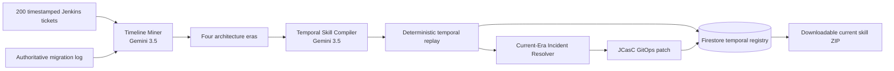

# Runbook Drift architecture

## Authority order

1. Current architecture declaration
2. Migration change log
3. Recent current-era tickets
4. Older historical tickets
5. Historical frequency

A high-frequency old action cannot override an explicit migration event.

## Agents

- **Timeline Miner:** detects operational eras from timestamps, tools, resolutions, and architecture evidence.
- **Temporal Skill Compiler:** creates the current workflow and converts retired actions into negative constraints.
- **Current-Era Incident Resolver:** resolves a new incident only with current tools and produces a JCasC patch.

## Deterministic publication gate

Publication requires all temporal checks to pass: current era, GKE agent diagnostics, Workload Identity, Git pull request, JCasC validation, Argo CD diff-before-sync, stale VM rejection, direct Helm rejection, and valid patch fields.
